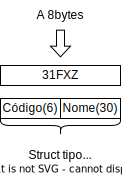
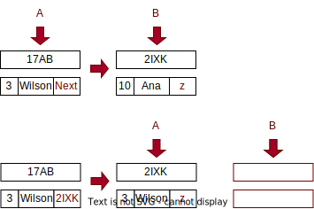

[🔝](../README.md)
# 26/02/2024 - Aula 002

## Comando Malloc

> O procedimento Malloc tem como parámetro uma variável do tipo ponteiro e, quando ativada, aloca espaço de memória de acordo com a declaração do tipo do ponteiro.

```c copy
    A = (no*) malloc (seziof(no));
```

> quando executado este comando, ele aloca um paço de memoria a variável do tipo ponteiro. Podemos refirmar que "A" apontado para estrutura de tipo nó, permitindo o  armazenamento dos dados.



> A estutura tipo nó não é inicializada pois nada ainda é armazenado em nó.
> A váriavel "A" contém o endereço dessa estrutura, permitindo o acesso através do comando printf.
> Podemos operar os dados da mesma forma que as operações estáticos. Para operar dados usando ponteiro adapta-se o concatenador "->", conforme exemplo abaixo:

```c copy
    A -> codigo =1;
    
    scanf("%s", &A->nome);

    A -> valor += salario;

    if(A -> valor > 10000)
    {
        //codigo
    }
```

## Comando Null

> Quando necessitamos manter o ponteiro limpo, ou seja, sem referencia de memória, recomenda-se atribuir Null a variável antes de inicializa-la.

**Exemplo:**

```c copy
    A=Null;
    B=Null;
```

## Comando FREE

> Quando necessitamos apagar um nó, ou devolver este endereço de memória ao Sistema Operacional, utiliza-se o comando FREE(), que corresponde Remover/Apagar um dado que está ocupando endereço de memória.

```c copy
    #include<studio.h>
    #include<stdlib.h>

    typedef struct no 
    {
        int codigo;
        char nome[30];
    } no;

    struct no *A, *B, *C;

    int main ()
    {
        A = Null;
        B = Null;
        C = Null;

        A(no*) malloc (size(no));

        print ("\n informe o código");

        scanf("%d", &A-> codigo);

        printf("\n informe o nome");

        scanf("%s", &A->nome);

        B=A;
        C=A;

        B(no*) malloc (sizeof(no));

        printf("\n informe o codigo");

        scanf("%d", &B->codigo);

        printf ("\n informe o nome");

        scanf("%s", &B->nome);

        C=(no*) malloc (sizeof(no));

        printf("\n informe o codigo");

        scanf("%s", &C->codigo);

        printf("\n informe o nome");

        scanf("&d", &C->nome);

        print("\n informe o nome);

        scanf("%s", &A->nome);

        FREE(B);

        A=C;
        B=C;

        FREE(C);
    }
```
1) Az
2) Az Bz
3) Az Bz Cz
4) Bz Cz
    A->[?][?]
5) Bz cz
    A->[7][?]
6) Bz Cz
    A->[7][Wilson]
7)  B-|-> [7][Wilson]
    A-|
    Cz
8)  B-|
    C-|-> [7][Wilson]
    A-|
9)  A-|-> [7][Wilson]
    C-|
    B->[?][?]
10) A-|-> [7][Wilson]
    C-|
    B->[10][]
11) A-|-> [7][Wilson]
    C-|
    B->[10][Ana]
12) A->[7][Wilson]
    B->[10][Ana]
    C->[?][?]
13) A->[7][Wilson]
    B->[10][Ana]
    C->[9][]
14) A->[7][Wilson]
    B->[10][Ana]
    C->[9][Juvenal]
15) A->[7][Wilson]
    __B->[10][Ana]__
    C->[9][Juvenal]
16) [7][Wilson]
    A |-> [9][Juvenal]
    B |
17) [7][Wilson]
    B-|
    C-|-> [9][Juvenal]
    A-|
18) __B-|__
    __C-|-> [9][Juvenal]__
    __A-|__

## Técnica para encadeamento

> A fim de obter a integridade da lista será necessário fazer o encadeamento dos nos garantindo o armazenamento e a recuperação dos dados na lista.
> Para conseguir efetuar o encadeamento será necessário estabelecer sem ponteiro na struct do nó, chamamos de ponteiro de estrutura, sua finalidade será armazenar o endereço do nó seguinte.

**Vejamos Exemplo - "struct"**

```c copy
    type def struct no
    {
        int codigo;
        char nome[30];
        struct no *next;
    } no;

    struct *A, *B, *C;
```

> Com base nesta struct teremos a seguinte configuração.


> Conforme ilustração abaixo podemos visualizar o encadeamento.



```c text
    A->next = B;
    B->next = Null;
```

> Para conseguir efetuar o encadeamento será necessário estabelecer sem ponteiro na struct do nó, chamamos de "ponteiro de estrutura", sua finalidade será armazenar o endereço do nó seguinte.

**Vejamos Exemplo - "struct"**

```c text
    #include<stdio.h>
    #include<stdlib.h>

    typedef struct no
    {
        int codigo;
        char nome[30];
        struct no *next;
    }no;

    struct no *A, *B;

    int main()
    {
        A = NULL;
        B = NULL;

        int i;

        for(i=0; i<5; i++)
        {
            A =(no*)malloc(sizeof(no));
            printf("\n informe o codigo ");
            scanf("%d", &A->codigo);
            printf("\n informe o nome ");
            scanf("%s", &A->nome);
            B = A;
            B -> next = A;
            B = A;
            A -> next = NULL;
        }

        return 0;
    }
```

[Exemplo 001](exemplo002/exemplo002.c)